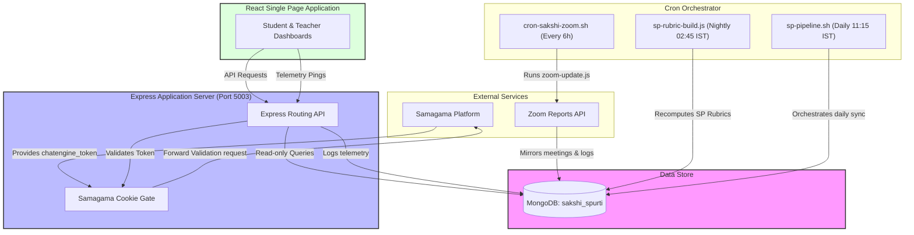
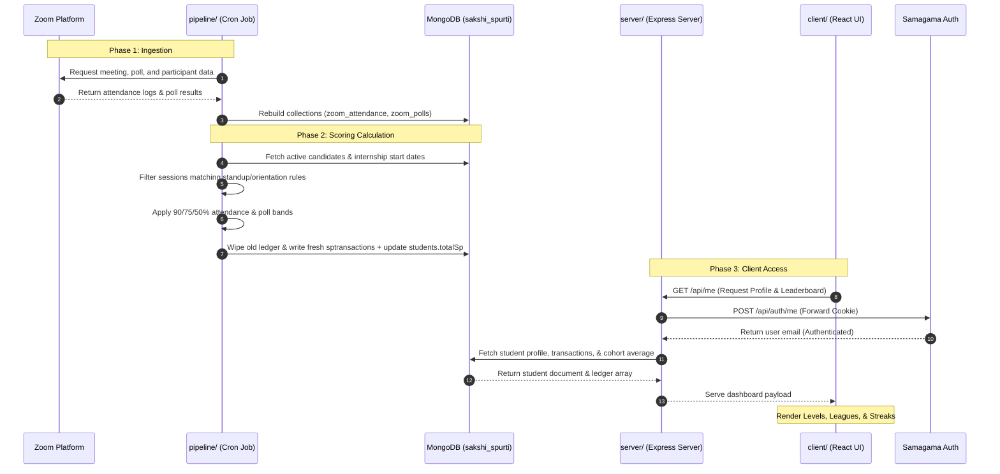

# ARCHITECTURE.md - Spurti Architecture Document

## Table of Contents
1. [Architectural Overview](#1-architectural-overview)
2. [The Two Halves Design](#2-the-two-halves-design)
3. [System Architecture Diagram](#3-system-architecture-diagram)
4. [Workflow & Data Ingestion Diagram](#4-workflow--data-ingestion-diagram)
5. [Folder Structure](#5-folder-structure)
6. [Data Flow & Integration Points](#6-data-flow--integration-points)

---

## 1. Architectural Overview

Spurti is designed as an asynchronous, decoupled system split into a **Web Application** and an **SP Scoring Pipeline**. The primary communication channel and single source of truth between these two components is a shared **MongoDB** instance (`sakshi_spurti`). 

By separating the ingestion and scoring engine from the web app, Spurti ensures that heavy background data operations do not degrade web user experience. Furthermore, this design isolates backend API calls to third-party services (such as the Zoom Reports API) from the student-facing presentation layer.

---

## 2. The Two Halves Design

```
                     ┌──────────────────┐
                     │   Zoom Reports   │
                     └────────┬─────────┘
                              │ cron
                              ▼
  ┌──────────────────────────────────────────────────────┐
  │ 1. SP pipeline (pipeline/)                           │
  │    - Fetches Zoom meetings, attendance, & polls      │
  │    - Rebuilds students' SP balances                  │
  │    - Writes ledger data to MongoDB                   │
  └──────────────────────────┬───────────────────────────┘
                             │
                             ▼
                    ┌──────────────────┐
                    │     MongoDB      │
                    │ (sakshi_spurti)  │
                    └────────┬─────────┘
                             │
                             ▼
  ┌──────────────────────────────────────────────────────┐
  │ 2. Web Application (server/ + client/)               │
  │    - Serves student and teacher dashboards           │
  │    - Read-only consumer of MongoDB (for SP details)  │
  │    - Processes manual review actions                 │
  └──────────────────────────────────────────────────────┘
```

1. **SP Pipeline (pipeline/)**: A scheduled scoring engine (configured via Linux cron) running as a background service. It executes zoom update commands, mirrors candidates' rosters, processes attendance thresholds, calculates poll attempts, applies scoring bands, and regenerates the database transaction ledger.
2. **Web Application (server/ + client/)**: A MERN stack application (React SPA + Node.js Express server) that reads student scores, displays leaderboards, processes telemetry pings, and authenticates students via Samagama cookie forwarding.

---

## 3. System Architecture Diagram

This diagram displays how third-party platforms, cron schedulers, databases, and client devices interact:



---

## 4. Workflow & Data Ingestion Diagram

The following diagram tracks the sequential flow of session data, starting from when a Zoom meeting finishes to the student viewing their updated SP bank:



---

## 5. Folder Structure

The repository is structured as follows:

```text
spurti/
├── client/                      # React Frontend SPA
│   ├── public/                  # Static assets
│   ├── src/                     # React application logic
│   │   ├── main.jsx             # Combined dashboard components
│   │   └── styles.css           # Vanilla CSS styles and color tokens
│   ├── index.html               # Main entry HTML
│   ├── package.json             # Frontend script configuration
│   └── vite.config.js           # Vite server settings
├── server/                      # Express Backend Server
│   ├── models/                  # Mongoose MongoDB schemas
│   │   ├── AnalyticsSnapshot.js # Weekly analytics logging
│   │   ├── Student.js           # Student metadata, level, league
│   │   └── SPTransaction.js     # Append-only transaction log
│   ├── services/                # Business services
│   │   ├── levels.js            # Pure level & league calculations
│   │   └── spLedger.js          # Transaction writers & readers
│   ├── config.js                # App variables & fallbacks
│   └── server.js                # Server entry, routing, and middlewares
├── pipeline/                    # Data pipeline and Scoring engine
│   ├── models/                  # Pipeline schemas
│   │   └── User.js              # Samagama mirrored User models
│   ├── sp-pipeline.sh           # Main orchestration shell script
│   ├── sp-pipeline.cron         # Production cron job specs
│   ├── sp-rubric-build.js       # Core scoring calculations (A+B bands)
│   ├── sp-rubric-build-mirror.cjs # Scoring code reading DB mirrors
│   └── sync-spurti-from-sakshi.js # Syncs SP ledger to Samagama database
├── data/                        # Local seed database files
├── package.json                 # Top-level setup and helper runner scripts
└── README.md                    # Main entry documentation file
```

---

## 6. Data Flow & Integration Points

- **Authentication**: Authenticated via the standard `chatengine_token` cookie. The web client passes cookies to `server.js` on `/api/me`. The Express server extracts the cookie and forwards it to Samagama's internal OAuth handler.
- **Scoring Pipeline**: Triggered automatically in background crons. Once computed, the data is pushed from `sakshi_spurti` into `chatengine` so that students can see their SP status directly in the Samagama chat interface.
- **Admin Review Queue**: Unused chat transcripts or manually triggered events are stored as `chatspreviews`. Instructors review these entries via `/api/admin/chat-sp-reviews` to accept or reject discretionary increments.
