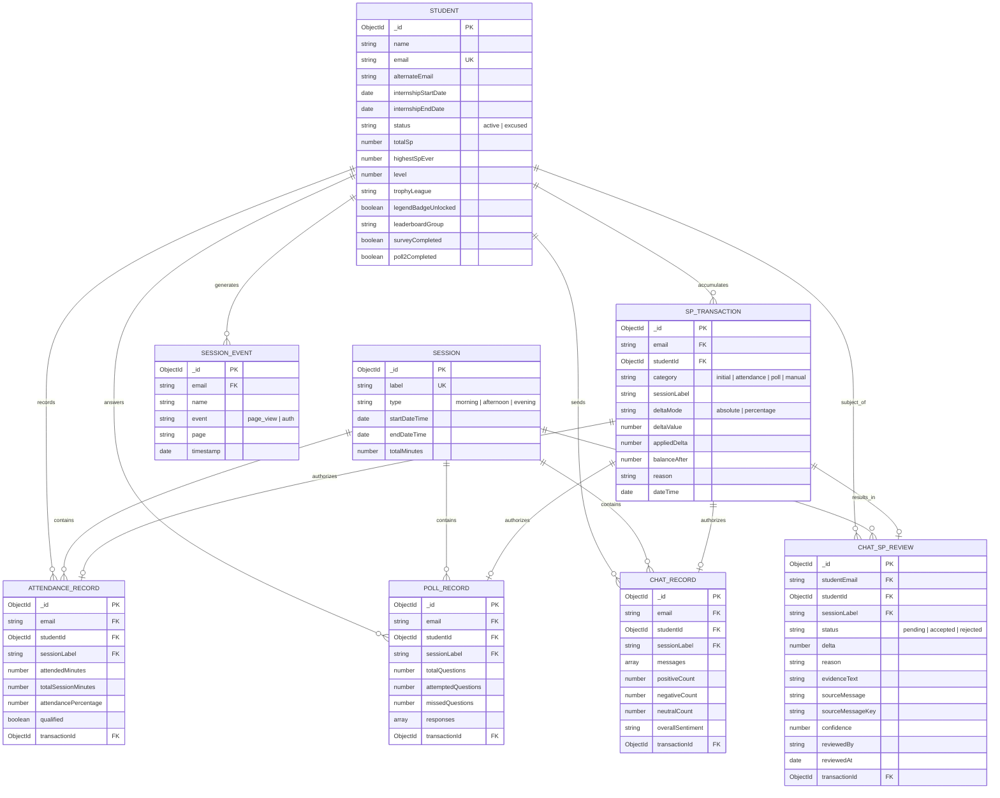

# DATABASE.md - Spurti Database Schema Guide

## Table of Contents
1. [Overview](#1-overview)
2. [Entity-Relationship Diagram (ERD)](#2-entity-relationship-diagram-erd)
3. [Collection Schemas](#3-collection-schemas)
   - [3.1 Students (`students`)](#31-students-students)
   - [3.2 Sessions (`sessions`)](#32-sessions-sessions)
   - [3.3 SP Transactions (`sptransactions`)](#33-sp-transactions-sptransactions)
   - [3.4 Attendance Records (`attendancerecords`)](#34-attendance-records-attendancerecords)
   - [3.5 Poll Records (`pollrecords`)](#35-poll-records-pollrecords)
   - [3.6 Chat Records (`chatrecords`)](#36-chat-records-chatrecords)
   - [3.7 Chat SP Reviews (`chatspreviews`)](#37-chat-sp-reviews-chatspreviews)
   - [3.8 Session Events (`sessionevents`)](#38-session-events-sessionevents)
   - [3.9 Analytics Snapshots (`analyticssnapshots`)](#39-analytics-snapshots-analyticssnapshots)
4. [Indexing Strategy](#4-indexing-strategy)

---

## 1. Overview

Spurti uses **MongoDB** as its primary database. The database namespace used in production is `sakshi_spurti`.

The design balances consistency and performance:
- **Append-only ledger**: `sptransactions` stores all individual increments/decrements. This ensures query idempotency and auditability.
- **Derived status caches**: Student levels, leagues, and current total SP are cached directly in the `students` documents, avoiding heavy runtime aggregation queries.
- **Relational references**: Documents are linked using standard MongoDB ObjectIDs or canonical student emails.

---

## 2. Entity-Relationship Diagram (ERD)

This ERD maps the relationships between MongoDB collections:



---

## 3. Collection Schemas

### 3.1 Students (`students`)
Stores candidate demographics, lifecycle states, and dynamic gamification progress.

```javascript
{
  name: { type: String, required: true, trim: true, index: true },
  email: { type: String, required: true, lowercase: true, trim: true, unique: true, index: true },
  alternateEmail: { type: String, lowercase: true, trim: true, default: '', index: true },
  internshipStartDate: { type: Date, required: true, index: true },
  internshipEndDate: { type: Date, default: null },
  status: { type: String, enum: ['active', 'excused'], default: 'active', index: true },
  excusedAt: { type: Date, default: null },
  excusedReason: { type: String, default: '' },
  totalSp: { type: Number, default: 100, index: true },
  highestSpEver: { type: Number, default: 100, index: true },
  level: { type: Number, default: 1 },
  trophyLeague: { type: String, default: 'Bronze II' },
  legendBadgeUnlocked: { type: Boolean, default: false },
  leaderboardGroup: { type: String, default: '', index: true },
  surveyCompleted: { type: Boolean, default: false, index: true },
  surveyCompletedAt: { type: Date, default: null },
  poll2Completed: { type: Boolean, default: false, index: true },
  poll2CompletedAt: { type: Date, default: null },
  weeklyGoals: [{
    weekLabel: { type: String, required: true },
    targetLeague: { type: String, default: '' },
    focusArea: { type: String, enum: ['attendance', 'polls', 'both', 'none'], default: 'both' },
    reflection: { type: String, trim: true, default: '' },
    createdAt: { type: Date, default: Date.now }
  }]
}
```

---

### 3.2 Sessions (`sessions`)
Keeps track of mandatory lectures, stands, orientations, and durations.

```javascript
{
  label: { type: String, required: true, unique: true, trim: true },
  date: { type: String, required: true }, // Format: YYYY-MM-DD
  type: { type: String, required: true, enum: ['morning', 'afternoon', 'evening'] },
  startDateTime: { type: Date },
  endDateTime: { type: Date },
  totalMinutes: { type: Number, required: true }
}
```

---

### 3.3 SP Transactions (`sptransactions`)
The transaction ledger. Tracks points changes, values, and resulting balances.

```javascript
{
  email: { type: String, required: true, lowercase: true, trim: true, index: true },
  studentId: { type: mongoose.Schema.Types.ObjectId, ref: 'Student', index: true },
  category: { type: String, required: true, enum: ['initial', 'attendance', 'poll', 'manual'], index: true },
  sessionLabel: { type: String, default: '', index: true },
  deltaMode: { type: String, enum: ['absolute', 'percentage'], default: 'absolute' },
  deltaValue: { type: Number, required: true },
  appliedDelta: { type: Number, required: true },
  balanceAfter: { type: Number, required: true },
  reason: { type: String, required: true },
  dateTime: { type: Date, required: true, index: true }
}
```

---

### 3.4 Attendance Records (`attendancerecords`)
Captures raw attendance information mapping to a student's session participation.

```javascript
{
  email: { type: String, required: true, lowercase: true, trim: true, index: true },
  studentId: { type: mongoose.Schema.Types.ObjectId, ref: 'Student', index: true },
  sessionLabel: { type: String, required: true, index: true },
  attendedMinutes: { type: Number, required: true },
  totalSessionMinutes: { type: Number, required: true },
  attendancePercentage: { type: Number, required: true },
  qualified: { type: Boolean, default: false, index: true },
  transactionId: { type: mongoose.Schema.Types.ObjectId, ref: 'SPTransaction' }
}
```

---

### 3.5 Poll Records (`pollrecords`)
Details student interactions with quizzes or polls launched during meetings.

```javascript
{
  email: { type: String, required: true, lowercase: true, trim: true, index: true },
  studentId: { type: mongoose.Schema.Types.ObjectId, ref: 'Student', index: true },
  sessionLabel: { type: String, required: true, index: true },
  totalQuestions: { type: Number, required: true },
  attemptedQuestions: { type: Number, required: true },
  missedQuestions: { type: Number, required: true },
  responses: [{
    questionNumber: Number,
    questionText: String,
    answerText: String,
    submittedAt: Date,
    isCorrect: Boolean
  }],
  transactionId: { type: mongoose.Schema.Types.ObjectId, ref: 'SPTransaction' }
}
```

---

### 3.6 Chat Records (`chatrecords`)
Tracks chat logs and sentiment analytics (currently archived).

```javascript
{
  email: { type: String, required: true, lowercase: true, trim: true, index: true },
  studentId: { type: mongoose.Schema.Types.ObjectId, ref: 'Student', index: true },
  sessionLabel: { type: String, required: true, index: true },
  messages: [{
    timestamp: Date,
    text: String,
    sentiment: { type: String, enum: ['positive', 'negative', 'neutral'] }
  }],
  positiveCount: { type: Number, default: 0 },
  negativeCount: { type: Number, default: 0 },
  neutralCount: { type: Number, default: 0 },
  overallSentiment: { type: String, default: 'neutral' },
  transactionId: { type: mongoose.Schema.Types.ObjectId, ref: 'SPTransaction' }
}
```

---

### 3.7 Chat SP Reviews (`chatspreviews`)
Administrative queue storing items flagged from transcripts for potential SP modifications.

```javascript
{
  sessionLabel: { type: String, required: true, index: true },
  dateTime: { type: Date, required: true },
  studentName: { type: String },
  studentEmail: { type: String, required: true, lowercase: true, trim: true },
  studentId: { type: mongoose.Schema.Types.ObjectId, ref: 'Student' },
  issuedByName: { type: String },
  delta: { type: Number, required: true },
  reason: { type: String },
  evidenceText: { type: String },
  sourceMessage: { type: String },
  sourceMessageKey: { type: String },
  confidence: { type: Number, default: 1.0 },
  status: { type: String, enum: ['pending', 'accepted', 'rejected'], default: 'pending', index: true },
  reviewedBy: { type: String },
  reviewedAt: { type: Date },
  transactionId: { type: mongoose.Schema.Types.ObjectId, ref: 'SPTransaction' }
}
```

---

### 3.8 Session Events (`sessionevents`)
Saves student navigation telemetry to enable active viewer tracking and usage logs.

```javascript
{
  email: { type: String, required: true, lowercase: true, index: true },
  name: { type: String },
  event: { type: String, default: 'page_view' },
  page: { type: String, required: true, index: true },
  timestamp: { type: Date, default: Date.now, index: true }
}
```

---

### 3.9 Analytics Snapshots (`analyticssnapshots`)
Caches weekly analytics historical graphs.

```javascript
{
  weekLabel: { type: String, required: true, unique: true }, // Format: YYYY-WXX
  calculatedAt: { type: Date, default: Date.now },
  activeUsersCount: Number,
  averageSp: Number,
  medianSp: Number,
  attendanceRate: Number,
  distribution: {
    below100: Number,
    from100to149: Number,
    from150to199: Number,
    from200plus: Number
  }
}
```

---

## 4. Indexing Strategy

- **Text Search Index**: The `students` collection features a text index over `name`, `email`, and `alternateEmail` for fast wildcard student searches on the landing page:
  ```javascript
  studentSchema.index({ name: 'text', email: 'text', alternateEmail: 'text' });
  ```
- **Compound Indexes**:
  - `sptransactions`: `{ email: 1, dateTime: 1, createdAt: 1 }` (optimizes ledger building queries)
  - `sptransactions`: `{ sessionLabel: 1, category: 1 }` (checks for duplicate insertions during ingestion runs)
- **Single Field Indexes**: Single indexes are configured on lookup attributes like `alternateEmail`, `status`, `totalSp`, `leaderboardGroup`, and `surveyCompleted` to optimize dashboard leaderboard filters.
