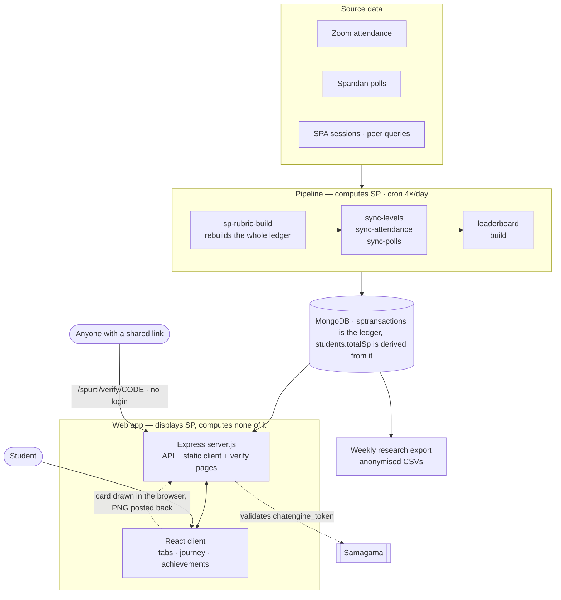

# Spurti

Student engagement tracking for the **VLED Summership internship at IIT Ropar**. Spurti awards
**SP (Spurti Points)** for taking part — attending standups, answering session polls correctly,
teaching and learning from peers (SPA), answering other interns' queries, and working through ViBe
courses — and shows each student where they stand, what they have earned, and what is left to do.

Live at **https://samagama.in/spurti/**, reached from a student's Samagama dashboard.

SP are a **participation signal, not academic marks.** They are deliberately kept separate from
grading: the point is to make consistency visible early enough to act on, not to rank people.
The longer-term product thinking behind that is in [PRODUCT.md](PRODUCT.md).

---

## What exists today

```text
SP ledger          every award is a row in sptransactions with a human-readable reason;
                   balances are rebuilt from the ledger, never incremented in place
Levels & leagues   permanent Level = floor(highestSpEver/100); a fluid trophy league
Leaderboards       cached boards: weekly + all-time, overall + per category, and
                   per onboarding group (biweekly cohorts)
My Journey         four tracks (standups, ViBe, SPA, projects) with student-set target dates;
                   the standup goal is 3,600 attended minutes
Achievements       permanent milestone and podium cards, shareable, each with a public
                   verify page and QR — env-gated, see Configuration
Admin dashboard    cohort stats, per-student records, SP audit views
```

Two independent halves, and it matters which one you are touching:

- **The web app** (`server/` + `client/`) — reads and displays. It does not compute SP.
- **The pipeline** (`pipeline/`) — recomputes the whole SP ledger from source data (Zoom
  attendance, Spandan polls, SPA and query activity) on a schedule, four times a day. This is
  where SP actually comes from.

`server/scripts/` holds the older one-off ingestion scripts, superseded by `pipeline/`.

## How it fits together



The arrow that matters: **SP only ever flows out of the pipeline into MongoDB, and the app only
reads it.** If a number looks wrong, the bug is almost always upstream of anything in `server/`.

---

## Running it locally

**You need:** Node 20+, a MongoDB you can write to, and a `.env`.

```bash
git clone https://github.com/vicharanashala/spurti.git
cd spurti
cp .env.example .env          # then edit MONGO_URI at least
npm run setup                 # installs both halves, rebuilds derived data, builds the client
npm start                     # serves the API and the built client on PORT (default 5290)
```

Then open `http://localhost:5290/spurti/`.

**Working on the client?** Run the Vite dev server instead of rebuilding each time — it proxies
`/api` and `/spurti` to the Node server on 5290, so run both:

```bash
npm start                          # terminal 1 — API on 5290
npm --prefix client run dev        # terminal 2 — UI on 5291 with hot reload
```

**One thing that will confuse you first time:** student login is not Spurti's. A student is
identified by the `chatengine_token` cookie that **Samagama** sets, which Spurti validates against
`SAMAGAMA_AUTH_URL` (Samagama's own service, normally on port 5001). With no Samagama running
locally you will not have a student session. For local work, keep `ALLOW_STUDENT_SEARCH=true` and
look students up by email instead — that path is disabled in production on purpose.

**Useful scripts:**

```bash
npm run rebuild          # rebuild derived collections (levels, boards, trajectories)
npm run seed             # seed a local database
npm run add-students     # add students from a CSV
npm run sync-students    # sync the student list from the source sheet
npm run ingest-session   # ingest one session's attendance
```

---

## Repository layout

```text
server/
  server.js            all HTTP routes (~1,200 lines) — API under /api, static client, verify pages
  config.js            env + the historical May session tables
  models/              Mongoose schemas: Student, SPTransaction, Achievement, ShareEvent, ...
  services/            the logic worth reading: leaderboards, achievements, levels, journey,
                       standup, spa, vibe, trajectory
  scripts/             legacy ingestion + one-off maintenance
  migrations/          dated, run-once scripts
  data/cards/          generated achievement card PNGs
client/
  src/main.jsx         the entire UI (~2,000 lines, single file)
  src/shareCard.js     the share card, drawn to canvas in the student's own browser
pipeline/              the SP recompute chain + its cron definitions; README.md inside
CONTEXT.md             the deep reference: schema, SP rubric, admin endpoints, server details
PRODUCT.md             why this exists — the motivation-engine design thinking
```

**Read `CONTEXT.md` before changing anything about how SP is calculated.** It documents the current
band/tier rubric, and the rubric has changed more than once.

---

## Configuration

Only two really matter to get started; the rest gate features that are off by default.

| Variable | Default | What it does |
|---|---|---|
| `MONGO_URI` | local `analysis_summership` | Database. Production uses `sakshi_spurti`. |
| `PORT` | `5290` | **Production runs on 5003**, set in its own `.env`. |
| `ALLOW_STUDENT_SEARCH` | `true` | Look up students by email. **`false` in production** — privacy. |
| `SAMAGAMA_AUTH_URL` | `http://127.0.0.1:5001/api/auth/me` | Where the student's cookie is validated. |
| `ADMIN_EMAIL`, `ADMIN_TOKEN` | unset | Admin dashboard. Sent as `x-admin-email` / `x-admin-token`. |
| `ACHIEVEMENTS_ENABLED` | off | The Achievements tab. |
| `ACHIEVEMENTS_SHARING` | off | The Share/Download buttons, **separately** — the tab stays visible either way. |
| `ACHIEVEMENTS_EMAILS` | unset | Preview the tab for named addresses only. |
| `PUBLIC_BASE_URL` | inferred | Absolute origin for `og:` tags on verify pages. |
| `CARD_DIR` | `server/data/cards` | Where generated card PNGs are written. |
| `VERIFY_VIEW_LOG` | on | Set `0` to stop logging verify-page views. |

Feature flags are read once at process start, so **flipping one needs a restart, not a redeploy.**

---

## Contributing

Small, single-purpose pull requests into `main`. Branch names follow what is already in the log:

```text
feat/<short-thing>      new behaviour        e.g. feat/exclude-spa-awards
fix/<short-thing>       a bug                e.g. fix/reign-tie-max
revert/<short-thing>    backing something out
```

Before opening a PR:

1. **`npm test`** — must pass.
2. `npm run build` if you touched the client.
3. Run it against a real database and click the thing you changed. The tests cover the pure
   scoring logic, not the routes or the UI (see below), so a lot still rests on you looking.
4. If you touched SP calculation, leaderboards or achievements, say in the PR **what numbers move
   and for whom**. These feed a research dataset; a silent change to scoring or ranking is
   indistinguishable from a change in student behaviour later.
5. If you added or renamed an env variable, update `.env.example` and the table above.

### Tests

```bash
npm test                              # the whole suite
node --test test/levels.test.js       # one file
node --test --watch test/*.test.js    # while working
```

Node's built-in `node:test` — no test dependencies to install, which keeps the dependency list at
four packages. Tests live in `test/`, one file per module.

**What is covered:** the pure functions where a wrong answer is expensive and silent — levels,
leagues, onboarding groups, weekly totals, rank ties, podium eligibility, and the share caption.
These are the places where a bug does not throw; it just awards the wrong thing to the wrong person
and nobody notices for a month.

**What is not covered yet:** HTTP routes, anything needing a database, the React UI, and the
pipeline. Those need fixtures or a test database and are the obvious next step. If you add coverage
there, say so in the PR — do not quietly leave `test/` looking more complete than it is.

Tests double as documentation of decisions that look arbitrary otherwise: why the joining grant is
excluded from weekly boards, why a placing shared by four people is not a placing, why ranks are
**not** unique and nothing may be keyed on them.

Worth knowing:

- **Nothing increments a balance.** SP is always recomputed from the ledger. If you find yourself
  writing `totalSp += x`, stop.
- **Achievements are permanent.** A card, once earned, keeps its `verifyId` forever, because that id
  is in a QR code on an image somebody has already posted publicly. Do not regenerate or renumber
  them.
- **The share card is drawn in the student's browser** and exported with `toDataURL`, so every asset
  it uses must be inlined as a data URI — a remote image taints the canvas and the export throws.
- Production and this repository can drift. Check what is actually deployed before assuming `main`
  is running.

## Where it runs

Production is on `samagama.in` behind nginx (which proxies `/spurti` to the Node process), kept
alive by PM2, with the SP pipeline on cron four times a day. Specifics — paths, process names, cron
times — are in `CONTEXT.md` and `pipeline/README.md`.

## Licence

MIT — see [LICENSE](LICENSE).

The code is MIT. **The data is not**, and none of it belongs in this repository: student names,
emails, attendance, poll responses and SP ledgers are personal data belonging to the interns.
`.gitignore` keeps `.env`, pipeline secrets and `server/data/` out; keep it that way, and never add
a CSV export or a generated card PNG to a commit.
