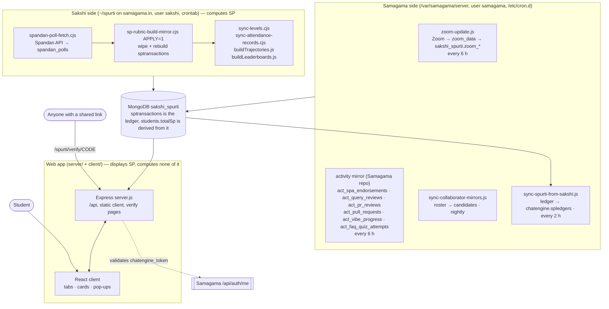

# Spurti

Student engagement tracking for the **VLED Summership internship at IIT Ropar**. Spurti awards
**SP (Spurti Points)** for taking part — attending standups, answering session polls correctly,
teaching and learning from peers (SPA), answering other interns' queries, finishing the project
review, completing the daily quiz — and shows each student where they stand, what they have
earned, and what is left to do.

Live at **https://samagama.in/spurti/**, reached from a student's Samagama dashboard.

SP are a **participation signal, not academic marks.** They are deliberately kept separate from
grading: the point is to make consistency visible early enough to act on, not to rank people.
The longer-term product thinking behind that is in [PRODUCT.md](PRODUCT.md); the rules as
students see them are in [FAQ_SP.md](FAQ_SP.md).

This repository is open for interns to contribute to. Read this page first, then
[CONTEXT.md](CONTEXT.md) before touching anything that computes SP.

---

## What a student sees

One React page with tabs. The tab bar depends on who is logged in.

```text
Student
  Leaderboard     weekly and all-time boards, overall and per category, and per onboarding group
  SP Bank         every SP transaction, newest first, with the human-readable reason; CSV export
  My Journey      four phases (Standups, ViBe, SPA, Projects) with self-set target dates and
                  pace-to-stay-on-track; the standup goal is 3,600 attended minutes
  Commitments     stake SP on finishing a ViBe course by a date, or pledge a week of standups
  SPA Points      the peer-teaching / peer-learning ledger, read from the Samagama mirror
  Achievements    permanent milestone and podium cards, each with a public verify page and QR;
                  a badge shows when a new card is waiting
  FAQ             the SP rules in plain language

Cards above the tabs
  Level / Trophy League / Legend status
  Announcements   programme notices with an explicit "Got it" read receipt
  Goal card       shown only to students carrying an arm on their record, during a set window
  Survey pop-up   up to three mandatory Google-Form surveys, env-gated, verified against the sheet

Admin (x-admin-email / x-admin-token headers)
  Leaderboard · Attendance · Live · Analytics · Achievements · Students
  plus announcement posting and read-rate tracking through the API
```

## How SP is earned

Every award is a row in `sptransactions` with a `category`, a signed delta and a reason a
student can read. Balances are **rebuilt from the ledger on every run, never incremented in
place.** Categories live in the ledger today:

| Category | Rule (current) | Source data | Since |
|---|---|---|---|
| `initial` | +100 to every started intern on their official start date | roster (`candidates`, `students`) | May 2026 |
| `attendance` | per session, tier ladder on the share of the official window attended: ≥90% → +10, 75–89% → +5, 50–74% → +3, else 0. Never negative. | Zoom presence (morning window to 15 Jul; evening window from 16 Jul); from 29 Jul the evening standup has no Zoom room, so attendance is **derived from Spandan poll correctness** (hybrid), with a Zoom fallback for special nights and V-Talks | May 2026, hybrid from 29 Jul |
| `poll` | per session, same tier ladder on poll correctness percentiled to the day's top scorer | Spandan Research API mirror (`spandan_polls`); frozen Zoom polls before 16 Jul | 16 Jul |
| `spa` | +5 per validated question learned (cap 50), +10 per validated peer taught (cap 25); fraud −50% / failed audit −20% of SP held | `act_spa_endorsements` mirror | Jul |
| `query` | +5 per distinct peer query answered, cap 200; rejected or unworthy answers earn nothing; admin-review penalties (−10 / −5) from 22 Aug, capped | `act_query_reviews` mirror | Aug |
| `project` | one-time +500 when the mentor review of the project PR completes | `act_pr_reviews` mirror | 5 Sep |
| `quiz` | daily FAQ quiz: 5/5 → +10, 4/5 → +5, 2–3 → 0, 0–1 → −7 (never below zero balance); broken-key questions count as correct | `act_faq_quiz_attempts` mirror | 15 Sep |
| `manual`, `peer_faq` | discretionary awards; preserved across rebuilds, never recomputed | admin | — |

Grace day 6 Jun: a one-minute join counts as full attendance and full poll. Students on the
certificate lock list are skipped. The exact windows, cutover dates and constants are in
`pipeline/sp-rubric-build-mirror.cjs` and explained in [CONTEXT.md](CONTEXT.md).

**Derived from the ledger, not in it:** Level = ⌊highestSpEver / 100⌋, the Trophy League (bands up
to Legend at 1,500 SP, the Legend badge is permanent once reached), the leaderboards, the
podium and milestone achievements, the SP trajectory, and the write-once **certificate
snapshot** (`certificate_finals`) taken at each student's own completion date.

## How it fits together

Three parts run on the same server, as two OS users, and only one of them computes SP.



The arrow that matters: **SP only ever flows out of `sp-rubric-build-mirror.cjs` into MongoDB,
and the app only reads it.** If a number looks wrong, the bug is almost always upstream of
anything in `server/`.

Student identity is not Spurti's. A student is whoever the `chatengine_token` cookie set by
Samagama says they are; `server.js` forwards the cookie to `SAMAGAMA_AUTH_URL` and looks the
email up in `students`. There is no login page.

## What runs when

| When (IST) | Where | What |
|---|---|---|
| 11:30, 17:30, 23:30, 05:30 | sakshi crontab | `sp-refresh.sh`: Spandan fetch → rubric APPLY → levels → attendance records → poll records → trajectory snapshot → leaderboards → backup retention → ViBe fetch. Single-instance lock; each step's outcome lands in a step-health file the admin dashboard shows |
| every 10 min while a survey is open | sakshi crontab | survey reconciliation against the Google Form responses — a small script kept outside this repository |
| weekly | sakshi crontab | `sp-runs-retention.sh` — thin the ledger backups that every APPLY writes under `sp-runs/` |
| 06:45, 12:45, 18:45, 00:45 | sakshi crontab | `pipeline/certificate-freeze.cjs APPLY=1` — adds newly completed students to `certificate_finals`; existing rows are never touched |
| Monday 06:15 | sakshi crontab | weekly research export (script kept outside this repository) |
| when new V-Talk data arrives | manual | `pipeline/vtalk-attendance-build.cjs` |
| every 6 h | samagama cron | `pipeline/samagama/cron-sakshi-zoom.sh` → `zoom-update.js` (Zoom into `zoom_data`, mirrored to `sakshi_spurti.zoom_*`) |
| every 6 h | Samagama repo | the `act_*` activity mirror the SPA, query, project, ViBe and quiz rules read |
| every 2 h | samagama cron | `pipeline/samagama/sync-spurti-from-sakshi.js` — copies the ledger back so the Samagama dashboard's SP button agrees with Spurti |
| nightly | samagama cron | `pipeline/samagama/sync-collaborator-mirrors.js` — roster mirror |

Feature flags are read once at process start, so **flipping one needs a restart, not a redeploy.**

## Repository structure

```text
server/
  server.js            all HTTP routes (~1,300 lines): /api under an Express router, static client,
                       verify pages, admin guard, survey config, the E2 card gate
  config.js            the four core env values and the historical May session tables
  models/              Mongoose schemas — Student, SPTransaction, Session, AttendanceRecord, PollRecord,
                       LeaderboardSnapshot, BoardReign, Achievement, AchievementView, ShareEvent,
                       Commitment, JourneyPlan, JourneyProgress, SpaProgress, VibeProgress,
                       TrajectorySnapshot, Announcement, AnnouncementAck,
                       E2CardEvent, SessionEvent, ActMirrors (read-only views over act_*)
  services/            the logic worth reading: leaderboards, levels, achievements, journey, standup,
                       vibe, spa, trajectory
  scripts/             buildLeaderboards.js and buildTrajectories.js (run by the refresh)
  seed-demo-local.mjs, seed-announcements-demo.mjs   throwaway local demo data (npm run seed)
  migrations/          dated run-once scripts (run BEFORE deploying the code that needs them)
  data/cards/          generated achievement card PNGs — gitignored
client/
  src/main.jsx         the entire UI (~2,400 lines, single file): tabs, cards, admin panels
  src/shareCard.js     the share card, drawn to canvas in the student's own browser
  src/vledLogo.js      the logo as a data URI (a remote image would taint the canvas)
  vite.config.js       dev server on 5291, proxies /api and /spurti to 5290
  vite.config.demo.js  same, for the demo seed
pipeline/              the SP recompute chain — README.md inside
  sp-rubric-build-mirror.cjs   THE scorer. Reads only sakshi_spurti mirrors; APPLY=1 to write
  spandan-poll-fetch.cjs       Spandan Research API → spandan_polls (poll and hybrid attendance source)
  vibe-fetch.cjs               ViBe course completion → vibe_course_progress (last step of the refresh)
  vtalk-attendance-build.cjs   V-Talk nights from the Zoom mirror → vtalk_attendance
  certificate-freeze.cjs       write-once certificate_finals
  sync-attendance-records.cjs / sync-poll-records.cjs   display collections rebuilt from the ledger
  samagama/                    the Samagama-side scripts (Zoom ingest and mirror, roster mirror,
                               ledger copy-back), kept verbatim as deployed there (absolute paths)
sp-refresh.sh          the sakshi-side 6-hourly refresh (see "What runs when")
sp-runs-retention.sh   backup retention for sp-runs/
sync-levels.cjs        Levels / Trophy League / Legend / onboarding group — idempotent, derived only
test/                  node:test suites for the pure scoring logic
CONTEXT.md             the deep reference: schema, the full SP rubric with its cutover dates, admin
                       endpoints, server paths, known incidents
FAQ_SP.md              the SP rules as students read them (also rendered in the FAQ tab)
PRODUCT.md             why this exists — the motivation-engine design thinking
```

## Running it locally

**You need:** Node 20+, a MongoDB you can write to, and a `.env`.

```bash
git clone https://github.com/vicharanashala/spurti.git
cd spurti
cp .env.example .env          # then edit MONGO_URI at least
npm run setup                 # installs both halves and builds the client
npm start                     # serves the API and the built client on PORT (default 5290)
```

Then open `http://localhost:5290/spurti/`.

**Working on the client?** Run the Vite dev server instead of rebuilding each time — it proxies
`/api` and `/spurti` to the Node server on 5290, so run both:

```bash
npm start                          # terminal 1 — API on 5290
npm --prefix client run dev        # terminal 2 — UI on 5291 with hot reload
```

**No student session locally.** With no Samagama running there is no `chatengine_token`. Keep
`ALLOW_STUDENT_SEARCH=true` and look students up by email; that path is off in production on
purpose. `npm run seed` against a database named `*demo*` gives you a small database to look at,
then point `MONGO_URI` in `.env` at it.

**Useful scripts:**

```bash
npm test                     # the whole test suite
MONGO_URI=mongodb://127.0.0.1:27017/spurti_demo npm run seed   # throwaway demo db; the seed
                             # refuses any database whose name lacks "demo" (it wipes collections)
MONGO_URI=mongodb://127.0.0.1:27017/spurti_demo npm run seed-announcements   # demo notices on top
node sync-levels.cjs         # recompute levels/leagues after any SP change (idempotent)
node server/scripts/buildLeaderboards.js
node server/scripts/buildTrajectories.js
```

The SP scorer itself needs the `sakshi_spurti` mirrors (Zoom, Spandan, roster, `act_*`), which
are not in this repository and never will be — they are student data. Locally you work on the
display layer against seeded or exported-and-anonymised data; scoring changes are verified on the
server with a dry run (`node pipeline/sp-rubric-build-mirror.cjs` with no `APPLY`).

## Configuration

Three example files, one per deployment. Copy the one you need to `.env`; never commit a filled-in
one (`.gitignore` already refuses).

| File | For |
|---|---|
| `.env.example` | local development, and the sakshi-side production checkout (the web app **and** `sp-refresh.sh` read the same file there) |
| `.env.ssh.example` | the same production checkout, with the values that differ from local |
| `pipeline/.env.example` | the Samagama-side scripts, which read `/var/samagama/server/.env` |

Variables the web app and the refresh read:

| Variable | Default | What it does |
|---|---|---|
| `MONGO_URI` | local `analysis_summership` | Database. Production uses `sakshi_spurti`. |
| `PORT` | `5290` | Production runs on 5003. |
| `ALLOW_STUDENT_SEARCH` | `true` | Look up students by email. `false` in production — privacy. |
| `SAMAGAMA_AUTH_URL` | `http://127.0.0.1:5001/api/auth/me` | Where the student's cookie is validated. |
| `ADMIN_EMAIL`, `ADMIN_TOKEN` | unset | Admin routes stay closed until both are set. Sent as `x-admin-email` / `x-admin-token`. |
| `ACHIEVEMENTS_ENABLED` | off | The Achievements tab. |
| `ACHIEVEMENTS_SHARING` | off | The Share/Download buttons, separately from the tab. |
| `ACHIEVEMENTS_EMAILS` | unset | Preview the tab for named addresses only. |
| `PUBLIC_BASE_URL` | inferred | Absolute origin for `og:` tags on verify pages. |
| `CARD_DIR` | `server/data/cards` | Where generated card PNGs are written. |
| `VERIFY_VIEW_LOG` | on | `0` stops logging verify-page views. |
| `SURVEY_*`, `POLL2_*`, `POLL3_*` | off | One block per mandatory survey: `_ENABLED`, `_FORM_URL`, `_EMAIL_ENTRY`, `_ENFORCEMENT` (hard/soft), `_DEADLINE`, `_WEBHOOK_SECRET`, `_RESPONSES_URL`, `_RESPONSES_SECRET`. |
| `E2_START`, `E2_DAYS` | unset, 7 | The goal-card window. Unset = card off everywhere. Which students carry an arm is decided outside this repository. |
| `DEMO` | unset | Demo seed mode for the seed scripts. |
| `STEP_HEALTH_FILE` | `sp-runs/step-health.tsv` | Where `sp-refresh.sh` records each step's outcome; the admin dashboard reads it. |
| `ALERT_WEBHOOK_URL`, `ALERT_WEBHOOK_SECRET`, `ALERT_AFTER` | unset | Where the refresh posts an alert after N consecutive failures of a step. Unset = log only. |
| `SPANDAN_RESEARCH_KEY` | unset | Key for the Spandan Research API the poll fetch reads. Required on the sakshi side. |
| `SPANDAN_CUTOFF`, `ATT_HYBRID_CUTOVER` | `2026-07-16`, `2026-07-29` | The two source cutover dates the scorer uses. Only override to replay history. |
| `QUIZ_SP_START` | `2026-09-15` | First quiz day that earns SP. |
| `CERT_LOCKED_EMAILS` | unset | Comma-separated students whose certificate is printed; the scorer skips them so printed numbers never drift. |

## API

All under `/api`, same-origin, JSON. Student routes need a valid Samagama cookie; admin routes
need the two admin headers; the verify page is public.

```text
Student   GET  /me  /config  /leaderboard  /leaderboard/board  /journey/state  /vibe/state
               /standup/state  /spa/state  /trajectory/state  /achievements  /announcements
          POST /confirm  /ping  /vibe/bet  /standup/commit  /achievements/seen
               /announcements/:id/ack  /share/card  /share/track  /e2/card-event
          PUT  /journey/plan  /vibe/bet/:id
          POST /vibe/bet/:id/settle  /standup/commit/:id/settle
Admin     GET  /admin/stats  /admin/active  /admin/students-by-status  /admin/student/:id
               /admin/attendance  /admin/leaderboard  /admin/analytics  /admin/announcements
          POST /admin/announcements  /admin/announcements/:id
Public    GET  /health  /search (only when ALLOW_STUDENT_SEARCH)  /spurti/verify/:code
```

## What was added when (2026)

```text
May       SP ledger, levels, leaderboards, admin dashboard; Samagama cookie auth (29 Jun)
Jun       scoring moved to the sakshi-side mirror scorer; band/tier rubric
Jul       evening standup window (16 Jul); Spandan polls replace Zoom polls (16 Jul);
          hybrid attendance from Spandan correctness (29 Jul); SPA Points tab and scoring;
          SP Bank; SP trajectory; My Journey phase goals; Commitments sub-tabs
Aug       Achievements with verify pages (12 Aug); query-answer SP with review gate and cap;
          announcements with Got-it tracking and audience targeting (21 Aug); unseen-card badge;
          query review penalty (21–22 Aug); ViBe completion mirror; goal-set snapshot in Journey;
          step-health + alert webhook in the refresh; README, licence, tests (17 Aug)
Sep       live Journey progress from the act_* mirrors (5 Sep); project +500 and SPA teach
          10 × cap 25 (5 Sep); certificate freeze (5 Sep, auto 8 Sep); E2 goal card (7 Sep);
          daily quiz SP + quiz leaderboards (15 Sep); Spandan email alias fix (17 Sep)
```

## Production vs repository

Production and `main` can drift, in both directions, and this has bitten before. Check what is
actually deployed before assuming `main` is running. Known at the time of writing:

- The daily quiz SP and the two extra refresh steps ran on the server for three days before they
  were committed (PR #221). If you find a behaviour on the site that the code here does not
  explain, ask before assuming a bug.
- Survey reconciliation and experiment tooling (arm assignment, analysis) are deliberately kept
  outside this repository, in the lab's private research folder.

## Contributing

Small, single-purpose pull requests into `main`. Branch names follow what is already in the log:

```text
feat/<short-thing>      new behaviour        e.g. feat/exclude-spa-awards
fix/<short-thing>       a bug                e.g. fix/reign-tie-max
docs/<short-thing>      documentation only
revert/<short-thing>    backing something out
```

Before opening a PR:

1. **`npm test`** must pass.
2. `npm run build` if you touched the client.
3. Run it against a real database and click the thing you changed. The tests cover the pure
   scoring logic, not the routes or the UI, so a lot still rests on you looking.
4. If you touched SP calculation, leaderboards or achievements, say in the PR **what numbers move
   and for whom**. These feed a research dataset; a silent change to scoring or ranking is
   indistinguishable from a change in student behaviour later.
5. If you added or renamed an env variable, update the matching `.env.example` **and** the table
   above in the same PR. This rule was skipped for a month once and every example file went stale.

### Tests

```bash
npm test                              # the whole suite
node --test test/levels.test.js       # one file
node --test --watch test/*.test.js    # while working
```

Node's built-in `node:test` — no test dependencies, which keeps the dependency list at four
packages (`express`, `mongoose`, `cors`, `dotenv`). Covered: levels, leagues, onboarding groups,
weekly totals, rank ties, podium eligibility, the share caption. Not covered: HTTP routes, anything
needing a database, the React UI, the pipeline. If you add coverage there, say so in the PR.

### Things that look arbitrary and are not

- **Nothing increments a balance.** SP is always recomputed from the ledger. If you find yourself
  writing `totalSp += x`, stop.
- **Rebuilds are wipe-and-reinsert**, except `manual` and `peer_faq`, which are preserved. A rule
  change re-scores history, so date-gate new rules (`QUERY_PEN_QUERY_START`, `QUIZ_SP_START`)
  instead of assuming they only apply going forward.
- **Achievements are permanent.** A card keeps its `verifyId` forever, because that id is in a QR
  code on an image somebody has already posted publicly. Do not regenerate or renumber them.
- **The share card is drawn in the student's browser** and exported with `toDataURL`, so every
  asset it uses must be inlined as a data URI. A remote image taints the canvas and the export
  throws.
- **Announcements are deactivated, never deleted.** Read receipts point at them.
- **The certificate snapshot is write-once.** Printed numbers must never drift.
- **Ranks are not unique** and nothing may be keyed on them.

## Where it runs

Production is on `samagama.in` behind nginx (which proxies `/spurti` to the Node process on 5003),
kept alive by PM2 under the `sakshi` user, with the refresh on cron four times a day. Paths,
process names and cron times are in `CONTEXT.md` and `pipeline/README.md`.

## Licence

MIT — see [LICENSE](LICENSE).

The code is MIT. **The data is not**, and none of it belongs in this repository: student names,
emails, attendance, poll responses, quiz attempts and SP ledgers are personal data belonging to the
interns. `.gitignore` keeps `.env`, pipeline secrets, `data/`, `server/data/`, `sp-runs/` and every
CSV out; keep it that way, and never add an export or a generated card PNG to a commit.
